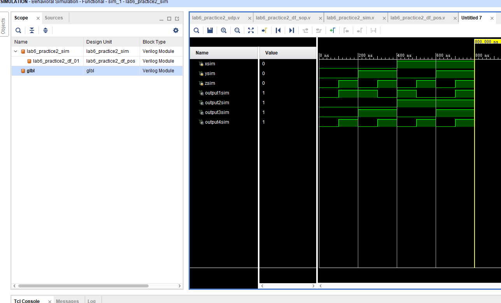

<!--
 * @Github: https://github.com/Certseeds/CS207_Digital_Design
 * @Organization: SUSTech
 * @Author: nanoseeds
 * @Date: 2020-08-12 22:22:09
 * @LastEditors: nanoseeds
 * @LastEditTime: 2020-08-12 23:42:58
-->
## Part 1

1. 
I: A AND B = 00000000  
II：A OR B = 10111111  
III: A XOR B =10111111  
IV: NOT A = 01001110  
V: NOT B = 11110001  
VI: NAND = 11111111  
VII: A NOR B = 01000000  

2. ignore  
3. ignore  
4. ignore  
5. ignore  

6. 
I: (a+b+c')*(a'b' +c) = ac +b'c'  
II: a'b'c + ab'c + abc + a'bc = c  
III: (a + c)(a'+ b + c)(a'+ b'+ c) = c  
IV: . A'BD' + ABC'D'+ ABCD' = BD'

7.  
I: F1 = abc ,F2 = abc' E = ab = sum of the miniterms of F1 and F2    
II: F1 = bc ,F2 = ac G = abc +a'b'c'= contains the minterms that are common to F1 and F2  

8. 
I F(x, y, z) = ∑(1, 3, 5, 7) = ∏(0,2,4,6)  
II: F(A, B, C, D) =  ∏ (3, 5, 8, 11, 13, 15) = ∑(0,1,2,4,6,7,9,10,12,14)

9. 
I: (b + d)(a'+ b'+ c)(a + c) = (b'c'+a'bc'+abc'd')  
II: a'b + a'c'+ bc =(a +b+c') (a'+b+c')(a'+b'+c)(a'+b+c')  

10.  
I: y'z' + yz' + x'z = z'+x'z =x' +xz' != x' +xz so it is false  
II:x'y'z+x'y'z' + xyz'+xy'z' + xyz+x'yz == xy'z'+x'y'z' + xyz+xyz'+x'yz+x'y'z so it is true  

11.  
I:F (w, x, y, z) = ∑(11, 12, 13, 14, 15) = wx + wyz  
II: F (w, x, y, z) = ∑(8, 10, 12, 13, 14) = wz'+wzy  

12.  
I:F (A, B, C, D) = ∑ (2, 3, 6, 7, 12, 13, 14) = A'C + ABC'+ABD'

|      |     00     |    01     |    11     |         10 |
| :--- | :--------: | :-------: | :-------: | ---------: |
| 00   | A'B'C'D' 0 | A'B'C'D 1 | A'B'CD 3√ | A'B'CD' 2√ |
| 01   | A'BC'D' 4  | A'BC'D 5  | A'BCD 7√  |  A'BCD' 6√ |
| 11   | ABC'D' 12√ | ABC'D 13√ |  ABCD 15  |  ABCD' 14√ |
| 10   | AB'C'D' 8  | AB'C'D 9  | AB'CD 11  |   AB'CD'10 |

So the sum of the function is A'C + ABC'+ABD'

II: F (w, x, y, z) = ∑(1, 3, 4, 5, 6, 7, 9, 11, 13, 15) = A'B+D

|      |     00     |     01     |    11     |        10 |
| :--- | :--------: | :--------: | :-------: | --------: |
| 00   | A'B'C'D' 0 | A'B'C'D 1√ | A'B'CD 3√ | A'B'CD' 2 |
| 01   | A'BC'D' 4√ | A'BC'D 5√  | A'BCD 7√  | A'BCD' 6√ |
| 11   | ABC'D' 12  | ABC'D 13√  | ABCD 15√  |  ABCD' 14 |
| 10   | AB'C'D' 8  | AB'C'D 9√  | AB'CD 11√ | AB'CD' 10 |

So the sum is A'B+D because the $2_{nd}$ & $3_{rd}$ row(D) and $2_{nd}$ column (A'B)are summed.

III: A'BCD + ABC + CD + B'D = ABC + CD + B'D

|      |     00     |     01     |    11     |        10 |
| :--- | :--------: | :--------: | :-------: | --------: |
| 00   | A'B'C'D' 0 | A'B'C'D 1√ | A'B'CD 3√ | A'B'CD' 2 |
| 01   | A'BC'D' 4  |  A'BC'D 5  | A'BCD 7√  |  A'BCD' 6 |
| 11   | ABC'D' 12  |  ABC'D 13  | ABCD 15√  | ABCD' 14√ |
| 10   | AB'C'D' 8  | AB'C'D 9√  | AB'CD 11√ | AB'CD' 10 |

So the sum of the formula is ABC + CD + B'D,with the $3_{rd}$ row (CD)and four *0*1(B'D) element and ABC.

IV: A'B'C'D' + BC'D + A'C'D + A'BCD + ACD = A'B'C'+ BD+ACD

|      |     00      |     01     |    11     |        10 |
| :--- | :---------: | :--------: | :-------: | --------: |
| 00   | A'B'C'D' 0√ | A'B'C'D 1√ | A'B'CD 3  | A'B'CD' 2 |
| 01   |  A'BC'D' 4  | A'BC'D 5√  | A'BCD 7√  |  A'BCD' 6 |
| 11   |  ABC'D'v12  | ABC'D 13√  | ABCD 15√  |  ABCD' 14 |
| 10   |  AB'C'D' 8  |  AB'C'D 9  | AB'CD 11√ | AB'CD' 10 |

The sum of the formula is A'B'C'+ BD+ACD, the *1*1 is the middle 4 element 5,7,13,15(BD), the sum of 0&1(A'B'C'),15&11(ACD).

13. 
I: F(A, B, C, D) = AD + BC'D+ ABC + A'BC'D = AD + BC'D + ABC
AD + BC'D + ABC =[ (A↑D)' ↑{(A↑B) ↑C'}' ↑{(B↑C') ↑D'} ]

II: F(A, B, C, D) = A'B'C'D + CD' + AC'D  = (C+D)(B'+D')(A+C'+D')
(C+D)(B'+D')(A+C'+D') = {(C' ↑D') ↑(B↑D) ↑(A' ↑C↑D)}'

III: F(A, B, C, D)= (A'+ C'+ D')(A'+ C')(C'+ D') = D'+A'CD'
D'+A'CD' = D' + (A' ↑C↑D')'

IV: F(A, B, C, D) = A'+ AB + B'C + ACD = (A'+B+D)
(A'+B+D) = (A' ↑B↑D)'

## PART 2: DIGITAL DESIGN LAB

### TASK1

The words before codes and graph
1. The first step of data flow way to design the nand gate is parameter two variables named Prot_Num and WIDTH, and then make maximum number [WIDTH:0] input variables and a output variables. Then use assign to make output equals to the nand of the input variables.
2. Using three repeat to make every state be used
3. Package it, and find it in my user folder.

#### Design

``` verilog
`timescale 1ns / 1ps
module NAND_V #(parameter Port_Num = 2,WIDTH = 1)(
    input[(WIDTH -1):0] a,
    input[(WIDTH -1):0] b,
    input[(WIDTH -1):0] c,
    input[(WIDTH -1):0] d,
    output[(WIDTH -1):0] output1
    );
    assign output1 = ~(a & b & c &d);
    //assign output1 = ~(a & b & c);
endmodule
```

#### SIMULATION
During the simulation , if there are four variables but just add three in it and do not give it value in the .sim document , it will make some mistake in the simulations   
Code: 
``` verilog
`timescale 1ns / 1ps
module NAND_sim();
      reg [1:0]sima = 2'h00;
      reg [1:0]simb =  2'h00;
      reg [1:0]simc =  2'h00;
      reg [1:0]simd = 2'h11;
      wire [1:0]simoutput1;
      NAND_V #(3,2) NAND_V_U(
.a(sima),
.b(simb),
.c(simc),
.d(simd),
.output1(simoutput1)
);
initial
begin
    simd = 3;
    repeat(4)
        begin 
        sima = sima + 1;
        repeat (4)
            begin 
            simb = simb + 1;
            repeat(4)
                begin
                #10
                simc = simc + 1;
                $display("sima,simb,simc,simd,simoutput1 ",sima," ",simb," ",simc," ",simd," ",simoutput1);
                end
            end
        end
end
endmodule
```


all of the code and waves is correct, after my calculate all of them are right.
Decibel of wave: 
oh! 
What a beautiful wave you are! 
You repeat dozens of times
Every time obey the same law.
solemn and respectful, dignified and stately
a wonderful product of vivado!
The waves are correct after verification.

If don’t add the variable simd, the graph will be 


Two graph of the simualation value in system task


FINALLY all of the code and waves is correct, after my calculate all of them are right.

#### PACKAGE IP CORES
Using tools creat-and-package-new-ip, it will creat a new page to finish the design 


The real name of the zip document is vender-library-Name-version so we shoule wirte the words in it. The graph below should add artix7 and other three types, change their life cycle to Production.


The graph adobe should change the two variables’ max and min like the graph below.


In this page make the graph below.


And then it will be easy to finish the package. After view the GUI and  finish package ,we will find it in the folder with the middle documents


#### PROBLEMS AND SOLUTIONS

1. In the task1’s simulation if we do not give simd a value then the output value will have bad X  Because the simd haven’t been defined.

Solutions: defined the simd to 2’h11 before wirte in the loop
2. Sometimes it will happen some strange things
Solutions: close vivado and open it again or even reboot computer

#### Addition
Describe of waves and codes in Simulation is provide
Problems and solution is provided
Description of waves are provided


### TASK2

Words before codes and graph
1. When using udp way to design it, there can not appear other variables to stand the input values.
2. And in the data-flow-by-primitive way it is easy to design variables to stand the input values.(of course using some temporary variables)
3. While doing the testbench document, it is better to design two kind of codes for those two type of documents.(because the dafa flow way use other three variables to stand the input)
4. I will show that the UDP file can not be used in synthesized ,just the data flow way can be used in the last steps.

#### DESIGN THE COUNT
1.  UDP way to design
CODE:
``` verilog
`timescale 1ns / 1ps
primitive lab6_practice2_udp(
     output1,
     x,
     y,
     z
    );
    output output1;
    input x,y,z;
    table
    0 0 0 :0;
    1 0 0 :1;
    0 1 0 :1;
    0 0 1 :1;
    1 1 0 :0;
    1 0 1 :0;
    0 1 1 :0;
    1 1 1 :1;
    endtable
endprimitive
```


(I don’t know why that when I add another file the udp document went to the Non-module-Files folder and it don’t go out unless there aren’t any other file in the folder)


2.  data flow way to design using sop and pos 

SOP CODE:
``` verilog
`timescale 1ns / 1ps
module lab6_practice2_df_sop(
    output output1,
    output output2,
    output output3,
    output output4,
    input x,
    input y,
    input z,
      wire temp1,
      wire temp2,
      wire temp3,
      wire temp4,
      wire temp5,
      wire temp6,
      wire temp7
    );
     not(temp1,x);
     not(temp2,y);
     not(temp3,z);
     and (temp4,x,temp2,temp3);
     and (temp5,y,temp1,temp3);
     and (temp6,z,temp1,temp2);
     and (temp7,x,y,z);
     or (output1,temp4,temp5,temp6,temp7);
    assign output2 = x;
    assign output3 = y;
    assign output4 = z;
endmodule
```


POS CODE:
``` verilog
`timescale 1ns / 1ps
module lab6_practice2_df_pos(
    output output1,
    output output2,
    output output3,
    output output4,
    input x,
    input y,
    input z,
    wire temp1,
    wire temp2,
    wire temp3,
    wire temp4,
    wire temp5,
    wire temp6,
    wire temp7
    );
    not(temp1,x);
    not(temp2,y);
    not(temp3,z);
    or (temp4,x,temp2,temp3);
    or (temp5,y,temp1,temp3);
    or (temp6,z,temp1,temp2);
    or (temp7,x,y,z);
    and (output1,temp4,temp5,temp6,temp7);
    assign output2 = x;
    assign output3 = y;
    assign output4 = z; 
endmodule
```


The last two kind of code take three variables to show the input variables

#### SIMULATION
CODE:

``` verilog
`timescale 1ns / 1ps
module lab6_practice2_sim();
    reg xsim,ysim,zsim;
    wire output1sim;
    wire output2sim;
    wire output3sim;
    wire output4sim;
    /*lab6_practice2_udp  lab6_practice2_udp_01(
     .output1(output1sim),
    .x(xsim),
    .y(ysim),
    .z(zsim)
    );*/
    lab6_practice2_df_sop  lab6_practice2_df_01(
         .output1(output1sim),
        .x(xsim),
        .y(ysim),
        .z(zsim),
        .output2(output2sim),
        .output3(output3sim),
        .output4(output4sim)
        );
    initial 
    begin
        {xsim,ysim,zsim} = 3'b0000;
        repeat(8)
        begin
            #100    {xsim,ysim,zsim} = {xsim,ysim,zsim}+1;
            $display($time,"{x,y,z}:%d",{xsim,ysim,zsim});
        end
        $finish(1);
    end
endmodule 
```


The output2,3,4 is design for the data flow way to show input
And the code in annotation is for the udp codes 

Graph 1: Data-flow-sop

The waves is correct, after my calculate all of them are right 

Graph 2: Data-flow-pos(I have to remind that the output1 is the output for x⊕y⊕p)	

The waves is correct, after my calculate all of them are right 

Graoph 3: UDP 

The waves is correct, after my calculate all of them are right 
Finally is the output in the system task all graph of the three graph are the same, so there just put one graph 

FINALLY all of the code and waves is correct, after my calculate all of them are right.

Decibel of wave: 
oh! 
What a beautiful wave you are! 
You repeat dozens of times
Every time obey the same law.
solemn and respectful, dignified and stately
a wonderful product of vivado!
The waves are correct after verification.

#### CONSTRAINT FILE AND THE TESTING
xI will do two kind of that first is for data-flow way and second for udp

In the I/O port step, we have three input and four output

Three input use three of the most left position, and three output is used to show the input more directive 

The most useful output is output1, it shows the final result of operation use a light.

All of them use the LVCMOS33 that the vlotage is 3.3 volt


and the xdc files is
Codes:
``` xdc
set_property IOSTANDARD LVCMOS33 [get_ports output1]
set_property IOSTANDARD LVCMOS33 [get_ports output2]
set_property IOSTANDARD LVCMOS33 [get_ports output3]
set_property IOSTANDARD LVCMOS33 [get_ports y]
set_property IOSTANDARD LVCMOS33 [get_ports z]
set_property IOSTANDARD LVCMOS33 [get_ports x]
set_property IOSTANDARD LVCMOS33 [get_ports output4]
set_property PACKAGE_PIN Y9 [get_ports x]
set_property PACKAGE_PIN W9 [get_ports y]
set_property PACKAGE_PIN Y7 [get_ports z]
set_property PACKAGE_PIN A21 [get_ports output1]
set_property PACKAGE_PIN K17 [get_ports output2]
set_property PACKAGE_PIN L13 [get_ports output3]
set_property PACKAGE_PIN M13 [get_ports output4]
```


This is the graph when udp files try to synthesis.


Just as the lab5 say, UDP can be used in simulation but can not be synthesized.(and of course  can not be implement and produce bitstream files)

FINALLY all of the code is correct, after my calculate all of them are right..

Next five picture is for data-flow way


Y9(0) + W9 (0)+ Y7(0) → A21(0)


Y9(1) + W9 (0)+ Y7(0) → A21(1) 


Y9(0) + W9 (0)+ Y7(1) → A21(1)


Y9(0) + W9 (1)+ Y7(1) → A21(0)


Y9(1) + W9 (1)+ Y7(1) → A21(1)


### THE DESCRIPTION OF OPERATION
1. build a new project and named it then add source or later choose the artix7fgg484100-1’s type 

2. then we got in the real surface, we can add a file in the design source and named it with three input and one output, then we use udp way to make the real excel in the table. Then add another two files use data-flow way in sum of product and products of sum way, the last two using three input and four output. Three output for show input and the other to show result. The common using the same input and output name for easy to simulation. (I don’t know why that if I add other files then the udp’s .v file will go to the Non-module Files folder)

3. then we add a simulation file without any input or output but define reg and wire variable then bind the input with reg and output with wire. If doing the data flow simulation using four output and udp use just one. Also add two bind formula to use. Then it will change every #10; to change form 3’h000 and 3’h111. Finally, before the endmole needs an end. 
IV do the simulation and do the synthesis (UDP cannot be synthesis) will be Smooth sailing, after simulation we will get the simulation graph like ladder. And the synthesis will bring a graph like real chips Sometimes it will happen cannot find ports on this module then we can close vivado and open it once again it will disappear.

4. Do the implementation, after that we can define the i/o ports we set input with the switch’s code and output with their code at the order. Do not forget the voltage to 3.3V

5. produce the bitstream file and connect the platform. If nothing had been found, connect the usb once again and click it to stop server. Then do auto connect.

6. Finally program the device in the green strip, we will have a programed platform, test it and take photos.

### PROBLEMS AND SOLUTIONS
Task1:
1.	Sometimes it will happen some strange things
Solutions: close vivado and open it again or even reboot computer
2.	After add others files in the folder, the udp file will go to non-files folder
Solutions: disabled others file by the right click, then the simulation will be ok to run

### ADDITION
Describe of waves and codes in Simulation is provide

Description of I/O ports is provide in task two because only task two need it
Problems and solution is provided
Description of waves are provided
The poem is created by myself.