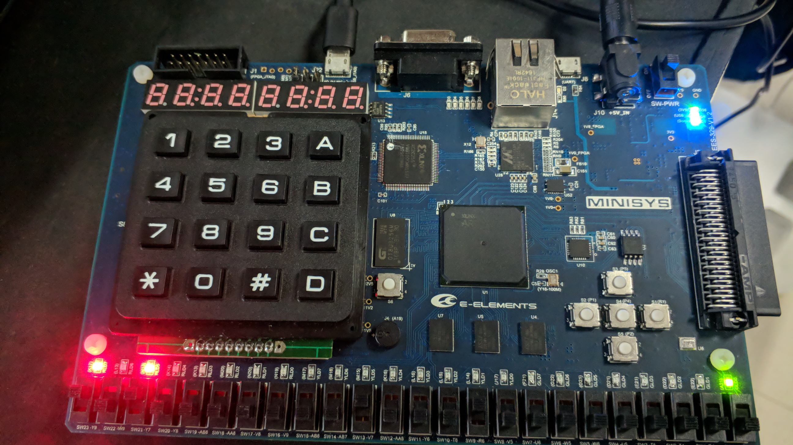

<!--
 * @Github: https://github.com/Certseeds/CS207_Digital_Design
 * @Organization: SUSTech
 * @Author: nanoseeds
 * @Date: 2020-08-13 00:07:44
 * @LastEditors: nanoseeds
 * @LastEditTime: 2020-08-13 01:47:23
-->

# DIGITAL DESIGN ASSIGNMENT REPORT


<div style="text-align:center">
ASSIGNMENT ID : ${Lab_Number} </br>
Student Name: ${YOUR_NAME}  </br>
Student ID: ${YOUR_ID} </br>  
</div>

## PART 1: DIGITAL DESIGN THEORY 
Provide your answers here: 
1. 


2. 


3. 


4. A = xy+xz+yz'   B = x'y' + yz + y'z'    C = x'y'z + xz' 

5. In the seven output, 1 means output and 0 is no output.

| 10_base_number |   A   |   B   |   C   |   D   |   a   |   b   |   c   |   d   |    e |    f |    g |
| :------------- | :---: | :---: | :---: | :---: | :---: | :---: | :---: | :---: | ---: | ---: | ---: |
| 0              |   0   |   0   |   0   |   0   |   1   |   1   |   1   |   1   |    1 |    1 |    0 |
| 1              |   0   |   0   |   0   |   1   |   0   |   1   |   1   |   0   |    0 |    0 |    0 |
| 2              |   0   |   0   |   1   |   0   |   1   |   1   |   0   |   1   |    1 |    0 |    1 |
| 3              |   0   |   0   |   1   |   1   |   1   |   1   |   1   |   1   |    0 |    0 |    1 |
| 4              |   0   |   1   |   0   |   0   |   0   |   1   |   1   |   0   |    0 |    1 |    1 |
| 5              |   0   |   1   |   0   |   1   |   1   |   0   |   1   |   1   |    0 |    1 |    1 |
| 6              |   0   |   1   |   1   |   0   |   1   |   0   |   1   |   1   |    1 |    1 |    1 |
| 7              |   0   |   1   |   1   |   1   |   1   |   1   |   1   |   0   |    0 |    0 |    0 |
| 8              |   1   |   0   |   0   |   0   |   1   |   1   |   1   |   1   |    1 |    1 |    1 |
| 9              |   1   |   0   |   0   |   1   |   1   |   1   |   1   |   1   |    0 |    1 |    1 |

So  a =B'C'D' + AB'C' + A'BC'D + A'C

|      |     00      |    01     |    11     |         10 |
| :--- | :---------: | :-------: | :-------: | ---------: |
| 00   | A'B'C'D' 0? | A'B'C'D 1 | A'B'CD 3? | A'B'CD' 2? |
| 01   |  A'BC'D' 4  | A'BC'D 5? | A'BCD 7?  |  A'BCD' 6? |
| 11   |  ABC'D' 12  | ABC'D 13  |  ABCD 15  |   ABCD' 14 |
| 10   | AB'C'D' 8?  | AB'C'D 9? | AB'CD 11  |  AB'CD' 10 |

: b = B'C' + A'C'D' + A'B' + A'CD

|      |     00      |     01     |    11     |         10 |
| :--- | :---------: | :--------: | :-------: | ---------: |
| 00   | A'B'C'D' 0? | A'B'C'D 1? | A'B'CD 3? | A'B'CD' 2? |
| 01   | A'BC'D' 4?  |  A'BC'D 5  | A'BCD 7?  |   A'BCD' 6 |
| 11   |  ABC'D' 12  |  ABC'D 13  |  ABCD 15  |   ABCD' 14 |
| 10   | AB'C'D' 8?  | AB'C'D 9?  | AB'CD 11  |  AB'CD' 10 |

:c = A'B + A'C' + B'C' + A'CD

|      |     00      |     01     |    11     |        10 |
| :--- | :---------: | :--------: | :-------: | --------: |
| 00   | A'B'C'D' 0? | A'B'C'D 1? | A'B'CD 3? | A'B'CD' 2 |
| 01   | A'BC'D' 4?  | A'BC'D 5 ? | A'BCD 7?  | A'BCD' 6? |
| 11   |  ABC'D' 12  |  ABC'D 13  |  ABCD 15  |  ABCD' 14 |
| 10   | AB'C'D' 8?  | AB'C'D 9?  | AB'CD 11  | AB'CD' 10 |

: d = B'C'D' + AB'C' + A'BC'D + A'B'C + A'CD'

|      |     00      |     01     |    11     |         10 |
| :--- | :---------: | :--------: | :-------: | ---------: |
| 00   | A'B'C'D' 0? | A'B'C'D 1  | A'B'CD 3? | A'B'CD' 2? |
| 01   |  A'BC'D' 4  | A'BC'D 5 ? |  A'BCD 7  |  A'BCD' 6? |
| 11   |  ABC'D' 12  |  ABC'D 13  |  ABCD 15  |   ABCD' 14 |
| 10   | AB'C'D' 8?  | AB'C'D 9?  | AB'CD 11  |  AB'CD' 10 |

:e = B'C'D' + A'CD'

|      |     00      |    01     |    11    |         10 |
| :--- | :---------: | :-------: | :------: | ---------: |
| 00   | A'B'C'D' 0? | A'B'C'D 1 | A'B'CD 3 | A'B'CD' 2? |
| 01   |  A'BC'D' 4  | A'BC'D 5  | A'BCD 7  |  A'BCD' 6? |
| 11   |  ABC'D' 12  | ABC'D 13  | ABCD 15  |   ABCD' 14 |
| 10   | AB'C'D' 8?  | AB'C'D 9  | AB'CD 11 |  AB'CD' 10 |

: f = A'C'D' + B'C'D' + A'BC' + AB'C' + A'BD'

|      |     00      |    01     |    11    |        10 |
| :--- | :---------: | :-------: | :------: | --------: |
| 00   | A'B'C'D' 0? | A'B'C'D 1 | A'B'CD 3 | A'B'CD' 2 |
| 01   | A'BC'D' 4?  | A'BC'D 5? | A'BCD 7  | A'BCD' 6? |
| 11   |  ABC'D' 12  | ABC'D 13  | ABCD 15  |  ABCD' 14 |
| 10   | AB'C'D' 8?  | AB'C'D 9? | AB'CD 11 | AB'CD' 10 |

: g = A'BC' + A'B'C + A'CD' + AB'C'
|      |     00     |    01     |    11     |         10 |
| :--- | :--------: | :-------: | :-------: | ---------: |
| 00   | A'B'C'D' 0 | A'B'C'D 1 | A'B'CD 3? | A'B'CD' 2? |
| 01   | A'BC'D' 4? | A'BC'D 5? |  A'BCD 7  |  A'BCD' 6? |
| 11   | ABC'D' 12  | ABC'D 13  |  ABCD 15  |   ABCD' 14 |
| 10   | AB'C'D' 8? | AB'C'D 9? | AB'CD 11  |  AB'CD' 10 |
So all of the output can express as the sum of products, what we need is 10 four input and many output and gate ,four input variable and four reverse input variables, & 10 or gate which has different input. The sum of the gates is 28.


The code is:
``` verilog
`timescale 1ns / 1ps
module temp1(
input A,B,C,D,
output a,b,c,d,e,f,g
    );
assign a = ( ~B & ~C & ~D) | (A & ~B & ~C) | (A & ~B & C& ~D) | (A & ~C);
assign b = (~B & ~C)| (~A & ~C & ~D)|(~A & ~B)|(~A & C & D);
assign c = (~A & B)| (~A & ~C)|(~C & ~B)|(~A & C & D);
assign d = (~B & ~C &~D)| (A & ~B & ~C)|(~A & B & ~C & D)|(~A & C & D)| (~A & ~B & C);
assign e = (~B & ~C & ~D)| (~A & C &~D);
assign f = (~A & ~C &~D)| (~B & ~C & ~D)|(~A & B & ~C)|(A & ~B & ~C)| (~A & B & ~D);
assign g = (~A & B &~C)| (~A & ~B & C)|(~A & C & ~D)|(A & C & ~D);
endmodule
```

6. 


a. for a binary multiplier that multiplies two unsigned four-bit numbers. 16 and gate and three four-bit-adder are needed to make the circuit.
the graph of the multiplier that multiplies two unsigned four-bit numbers is:
four_bit_multiplier_code:
``` verilog
`timescale 1ns / 1ps
  // 4 is the higest       
module four_bit_multply(
input firstMulti1,
input firstMulti2,
input firstMulti3,
input firstMulti4,
input secondMulti1,
input secondMulti2,
input secondMulti3,
input secondMulti4,
output output0,
output output1,
output output2,
output output3,
output output4,
output output5,     
output output6,
output output7);
   wire temp1;
   wire temp2;
   wire temp3;
   wire temp4;
   wire temp5;
   wire temp6;
   wire temp7;
   wire temp8;         
    assign output0 = firstMulti1 & secondMulti1;
    four_bit_adder fout_bit_adder1(
    (firstMulti2 & secondMulti1),(firstMulti2 & secondMulti2),
    (firstMulti2 & secondMulti3),(firstMulti2 & secondMulti4),
    (firstMulti1 & secondMulti2),(firstMulti1 & secondMulti3),
    (firstMulti1 & secondMulti4),0,
    temp1,temp2,temp3,temp4,output1);
    
    four_bit_adder fout_bit_adder2(
    (firstMulti3 & secondMulti1),(firstMulti3 & secondMulti2),
    (firstMulti3 & secondMulti3),(firstMulti3 & secondMulti4),
    temp4,temp3,temp2,temp1,
    temp5,temp6,temp7,temp8,output2);
    
    four_bit_adder fout_bit_adder3(
     (firstMulti4 & secondMulti1),(firstMulti4 & secondMulti2),
     (firstMulti4 & secondMulti3),(firstMulti4 & secondMulti4),
     temp8,temp7,temp6,temp5,
     output7,output6,output5,output4,output3);
     endmodule
four_bit_adder_code:
`timescale 1ns / 1ps
module four_bit_adder(
input firstAdd1,
input firstAdd2,
input firstAdd3,
input firstAdd4,
input secondAdd1,
input secondAdd2,
input secondAdd3,
input secondAdd4,
output isEn,
output output4,
output output3,
output output2,
output output1
);
wire temp1;
wire temp2;
wire temp3;
two_bit_adder add1(firstAdd1,secondAdd1,0,temp1,output1);
two_bit_adder add2(firstAdd2,secondAdd2,temp1,temp2,output2);
two_bit_adder add3(firstAdd3,secondAdd3,temp2,temp3,output3);
two_bit_adder add4(firstAdd4,secondAdd4,temp3,isEn,output4);
endmodule
two_bit_adder_code:
`timescale 1ns / 1ps
module two_bit_adder(
    input x,
    input y,
    input en,
    output isEn,
    output result
);
assign result = ( ~x & ~y & en) | (~x & y & ~en) |  ( x & ~y & ~en)  | (x & y & en);
assign isEn  = ( x & y) |( y & en) | (en & x);
    
endmodule
```

THE TEST CODE:
``` verilog
`timescale 1ns / 1ps
module four_bit_multi_sim(

    );
    reg sim1M1,sim1M2,sim1M3,sim1M4,sim2M1,sim2M2,sim2M3,sim2M4;
    wire simoutput1,simoutput2,simoutput3,simoutput4,simoutput5,simoutput6,simoutput7,simoutput8;
    four_bit_multply temp1(
    .firstMulti1(sim1M1),
    .firstMulti2(sim1M2),
    .firstMulti3(sim1M3),
    .firstMulti4(sim1M4), 
    .secondMulti1(sim2M1),
    .secondMulti2(sim2M2),
    .secondMulti3(sim2M3),
    .secondMulti4(sim2M4),
    .output0(simoutput1), 
    .output1(simoutput2),
    .output2(simoutput3),
    .output3(simoutput4),
    .output4(simoutput5),
    .output5(simoutput6),
    .output6(simoutput7),
    .output7(simoutput8)
    );
    initial
        begin
        {sim1M1,sim1M2,sim1M3,sim1M4} = 4'b0000;
        {sim2M1,sim2M2,sim2M3,sim2M4} = 4'b0000;
        repeat (15)
            begin
            #1
            {sim1M1,sim1M2,sim1M3,sim1M4} =  {sim1M1,sim1M2,sim1M3,sim1M4} + 1;
             repeat (16)
                 begin
                 #1
                  {sim2M1,sim2M2,sim2M3,sim2M4} =  {sim2M1,sim2M2,sim2M3,sim2M4} +1;
                   $display(sim1M1 + " " +sim1M2+ " "  +sim1M3+ " "  +sim1M4+ " "  +sim2M1 + " " +sim2M2+ " "  +sim2M3+ " "  +sim2M4 );
                 end
             end  
        end       
endmodule
```


we can also use the more directly way:
the .v_code:
``` verilog
`timescale 1ns / 1ps
module more_directly(
    input [3:0]m1,
    input [3:0]m2,
    output [7:0] output1
    );
    assign output1 = m1 * m2;
endmodule
```
the sim code:
``` verilog
`timescale 1ns / 1ps
module more_directly_sim();
reg [3:0]m1sim;
reg [3:0]m2sim;
wire [7:0]output1sim;
more_directly test1(
.m1(m1sim),
.m2(m2sim),
.output1(output1sim));
    initial 
        begin 
        m1sim = 4'b0000;
        m2sim = 4'b0000;
        repeat (15)
                    begin
                    #1
                    m1sim=  m1sim + 1;
                     repeat (16)
                         begin
                         #1
                         m2sim =  m2sim+1;
                           $display(m1sim +" " + m2sim );
                         end
                     end  
   end 
endmodule
```


7. EI: enable the input. EO:enable the output GS:gate spread

| EI   |   0   |   1   |   2   |   3   |   4   |   5   |   6   |   7   |   2   |   1   |   0   |  EO   |   GS |
| :--- | :---: | :---: | :---: | :---: | :---: | :---: | :---: | :---: | :---: | :---: | :---: | :---: | ---: |
| 1    |   x   |   x   |   x   |   x   |   x   |   x   |   x   |   x   |   1   |   1   |   1   |   1   |    1 |
| 0    |   x   |   x   |   x   |   x   |   x   |   x   |   x   |   0   |   0   |   0   |   0   |   1   |    0 |
| 0    |   x   |   x   |   x   |   x   |   x   |   x   |   0   |   1   |   0   |   0   |   1   |   1   |    0 |
| 0    |   x   |   x   |   x   |   x   |   x   |   0   |   1   |   1   |   0   |   1   |   0   |   1   |    0 |
| 0    |   x   |   x   |   x   |   x   |   0   |   1   |   1   |   1   |   0   |   1   |   1   |   1   |    0 |
| 0    |   x   |   x   |   x   |   0   |   1   |   1   |   1   |   1   |   1   |   0   |   0   |   1   |    0 |
| 0    |   x   |   x   |   0   |   1   |   1   |   1   |   1   |   1   |   1   |   0   |   1   |   1   |    0 |
| 0    |   x   |   0   |   1   |   1   |   1   |   1   |   1   |   1   |   1   |   1   |   0   |   1   |    0 |
| 0    |   0   |   1   |   1   |   1   |   1   |   1   |   1   |   1   |   1   |   1   |   1   |   1   |    0 |
| 0    |   1   |   1   |   1   |   1   |   1   |   1   |   1   |   1   |   1   |   1   |   1   |   0   |    1 |

If the input 2&6 is 1 and others are 0(included the EI), then the output is 02 01 10 1EO 0GS.

8. a
+  F(A, B, C, D) = ? (0, 2, 5, 8, 10, 14) = A'B'C'D' + A'B'CD' + A'BC'D+AB'C'D' + AB'CD' + ABCD' 

|       |       |       |       |       |       |
| :---: | :---: | :---: | :---: | :---: | :---: |
|   A   |   B   |   C   |   D   |   F   |       |
|   0   |   0   |   0   |   0   |   1   | F= D' |
|   0   |   0   |   0   |   1   |   0   |       |
|   0   |   0   |   1   |   0   |   1   | F= D' |
|   0   |   0   |   1   |   1   |   0   |       |
|   0   |   1   |   0   |   0   |   0   | F= 0  |
|   0   |   1   |   0   |   1   |   1   |       |
|   0   |   1   |   1   |   0   |   0   | F= 0  |
|   0   |   1   |   1   |   1   |   0   |       |
|   1   |   0   |   0   |   0   |   1   | F= D' |
|   1   |   0   |   0   |   1   |   0   |       |
|   1   |   0   |   1   |   0   |   1   | F= D' |
|   1   |   0   |   1   |   1   |   0   |       |
|   1   |   1   |   0   |   0   |   0   | F= 0  |
|   1   |   1   |   0   |   1   |   0   |       |
|   1   |   1   |   1   |   0   |   1   | F= D' |
|   1   |   1   |   1   |   1   |   0   |       |


+ b. F(A, B, C, D) = ? (2, 6, 11) = ?(0,1,3,4,5,7,8,9,10,12,13,14,15)  = A'B'C'D' + A'B'C'D + A'B'CD + A'BC'D' + A'BC'D + A'BCD + AB'C'D' + AB'C'D + AB'CD' + ABC'D' + ABC'D + ABCD' + ABCD

|       |       |       |       |       |       |
| :---: | :---: | :---: | :---: | :---: | :---: |
|   A   |   B   |   C   |   D   |   F   |       |
|   0   |   0   |   0   |   0   |   1   | F= 1  |
|   0   |   0   |   0   |   1   |   1   |       |
|   0   |   0   |   1   |   0   |   0   | F= D  |
|   0   |   0   |   1   |   1   |   1   |       |
|   0   |   1   |   0   |   0   |   1   | F= 1  |
|   0   |   1   |   0   |   1   |   1   |       |
|   0   |   1   |   1   |   0   |   0   | F= D  |
|   0   |   1   |   1   |   1   |   1   |       |
|   1   |   0   |   0   |   0   |   1   | F= 1  |
|   1   |   0   |   0   |   1   |   1   |       |
|   1   |   0   |   1   |   0   |   1   | F= D' |
|   1   |   0   |   1   |   1   |   0   |       |
|   1   |   1   |   0   |   0   |   1   | F= 1  |
|   1   |   1   |   0   |   1   |   1   |       |
|   1   |   1   |   1   |   0   |   1   |  F=1  |
|   1   |   1   |   1   |   1   |   1   |       |


9. Every full subtracter have three input and two output: the minuend ,the subtrahend, is the last borrow digit are input and is this digit will borrow digit and the result in this bit are double output.

|   A   |   B   | Ci-1  |  Ci   |   F1 =    |  Di   |   F2 =   |
| :---: | :---: | :---: | :---: | :-------: | :---: | :------: |
|   0   |   0   |   0   |   0   | F = Ci-1  |   0   | F = Ci-1 |
|   0   |   0   |   1   |   1   |           |   1   |          |
|   0   |   1   |   0   |   1   | F = Ci-1' |   1   |  F = 1   |
|   0   |   1   |   1   |   0   |           |   1   |          |
|   1   |   0   |   0   |   1   | F = Ci-1' |   0   |  F = 0   |
|   1   |   0   |   1   |   0   |           |   0   |          |
|   1   |   1   |   0   |   0   | F = Ci-1  |   0   | F = Ci-1 |
|   1   |   1   |   1   |   1   |           |   1   |          |

So the graph of the subtracter is       


10.  
|   A   |   B   |   C   |   D   |   F   |       |
| :---: | :---: | :---: | :---: | :---: | :---: |
|   0   |   0   |   0   |   0   |   0   | F= D  |
|   0   |   0   |   0   |   1   |   1   |       |
|   0   |   0   |   1   |   0   |   1   | F= 1  |
|   0   |   0   |   1   |   1   |   1   |       |
|   0   |   1   |   0   |   0   |   1   | F= 1  |
|   0   |   1   |   0   |   1   |   1   |       |
|   0   |   1   |   1   |   0   |   0   | F= 0  |
|   0   |   1   |   1   |   1   |   0   |       |
|   1   |   0   |   0   |   0   |   1   | F= D' |
|   1   |   0   |   0   |   1   |   0   |       |
|   1   |   0   |   1   |   0   |   1   | F= D' |
|   1   |   0   |   1   |   1   |   0   |       |
|   1   |   0   |   0   |   0   |   0   | F= D  |
|   1   |   1   |   0   |   1   |   1   |       |
|   1   |   1   |   1   |   0   |   0   | F= 0  |
|   1   |   1   |   1   |   1   |   0   |

So F = A'B'C'D + A'B'CD' + A'B'CD + A'BC'D' + A'BC'D + AB'C'D' + AB'CD' + ABC'D.       


## PART 2: DIGITAL DESIGN LAB

### TASK1
The words before codes and graph
1.|The first way is write the truth table and write the code, using four_bit_input_variable ,two eight_bit_output_variable and a four_bit_output_variable.
2.| Using one repeat to make every state be used,add the xdc file with setted seg-gate
3.|Then do the synthesis,set the I/Oports.
4.|Run implementation
5.|Generate the bitstream and use the borad to take photos. 

#### DESIGN 
CODE:
``` verilog
`timescale 1ns / 1ps
module Ass_3_1_v(
   input [15:0]input1,
   output reg [7:0]  seg_out,
   output [7:0] seg_en,
   output [15:0] output1
    );
    assign seg_en = ~8'hff;
    assign output1 = input1;
    always @*
    begin 
     casex(input1)
     16'bxxxxxxxxxxxxxxx1: seg_out = 8'b01000000;//0
     16'bxxxxxxxxxxxxxx10: seg_out = 8'b01111001;//1
     16'bxxxxxxxxxxxxx100: seg_out = 8'b00100100;//2
     16'bxxxxxxxxxxxx1000: seg_out = 8'b00110000;//3
     16'bxxxxxxxxxxx10000: seg_out = 8'b00011001;//4
     16'bxxxxxxxxxx100000: seg_out = 8'b00010010;//5
     16'bxxxxxxxxx1000000: seg_out = 8'b00000010;//6
     16'bxxxxxxxx10000000: seg_out = 8'b01111000;//7
     16'bxxxxxxx100000000: seg_out = 8'b00000000;//8
     16'bxxxxxx1000000000: seg_out = 8'b00010000;//9
     16'bxxxxx10000000000: seg_out = 8'b00001000;//A
     16'bxxxx100000000000: seg_out = 8'b00000011;//B
     16'bxxx1000000000000: seg_out = 8'b01000110;//C
     16'bxx10000000000000: seg_out = 8'b00100001;//D
     16'bx100000000000000: seg_out = 8'b00000110;//E
     16'b1000000000000000: seg_out = 8'b00001110;//F
     default:seg_out = 8'b0000000;
    endcase
end
```

all of the code and waves is correct, after my calculate all of them are right.

#### SIMULATION
During the simulation, because the amount of the case are too much,every step just stay in unit 1 time. But there still can not act enough cases.
Code:

``` verilog
`timescale 1ns / 1ps
module Ass_3_1_sim( );
reg [15:0]input1sim;
wire [7:0]seg_out_sim;
wire [7:0]seg_en_sim;
wire [15:0]output1sim;
Ass_3_1_v test(
.input1(input1sim),
.seg_out(seg_out_sim),
.seg_en(seg_en_sim),
.output1(output1sim));
    initial 
    begin 
    input1sim = 16'b0000000000000000;
    repeat(65536)
        begin
        #1
        input1sim = input1sim + 1;
         $display($time,"{input1,seg_out,seg_en,output1}:%d %d %d %d",input1sim,seg_out_sim,seg_en_sim,output1sim); 
        end
    end
endmodule
```


Because there are so many case that I just can take a few case to express it.


![task1 sim 2]./photo3/image023.png)


And this is some display , there are too much display there just put some
This is two example of the simualation value in system task

#### CONSTRAINT FILE AND THE TESTING
In this part I will do the synthesis, implementation(include the I/O ports set), generate bitstream and burn it in the board.


In this part choose to open synthesized design 


And the xdc files code is:
``` xdc
set_property IOSTANDARD LVCMOS33 [get_ports {seg_en[7]}]
set_property IOSTANDARD LVCMOS33 [get_ports {seg_en[6]}]
set_property IOSTANDARD LVCMOS33 [get_ports {seg_en[5]}]
set_property IOSTANDARD LVCMOS33 [get_ports {seg_en[4]}]
set_property IOSTANDARD LVCMOS33 [get_ports {seg_en[3]}]
set_property IOSTANDARD LVCMOS33 [get_ports {seg_en[2]}]
set_property IOSTANDARD LVCMOS33 [get_ports {seg_en[1]}]
set_property IOSTANDARD LVCMOS33 [get_ports {seg_en[0]}]
set_property IOSTANDARD LVCMOS33 [get_ports {seg_out[7]}]
set_property IOSTANDARD LVCMOS33 [get_ports {seg_out[6]}]
set_property IOSTANDARD LVCMOS33 [get_ports {seg_out[5]}]
set_property IOSTANDARD LVCMOS33 [get_ports {seg_out[4]}]
set_property IOSTANDARD LVCMOS33 [get_ports {seg_out[3]}]
set_property IOSTANDARD LVCMOS33 [get_ports {seg_out[2]}]
set_property IOSTANDARD LVCMOS33 [get_ports {seg_out[1]}]
set_property IOSTANDARD LVCMOS33 [get_ports {seg_out[0]}]
set_property PACKAGE_PIN C19 [get_ports {seg_en[0]}]
set_property PACKAGE_PIN E19 [get_ports {seg_en[1]}]
set_property PACKAGE_PIN D19 [get_ports {seg_en[2]}]
set_property PACKAGE_PIN F18 [get_ports {seg_en[3]}]
set_property PACKAGE_PIN E18 [get_ports {seg_en[4]}]
set_property PACKAGE_PIN B20 [get_ports {seg_en[5]}]
set_property PACKAGE_PIN A20 [get_ports {seg_en[6]}]
set_property PACKAGE_PIN A18 [get_ports {seg_en[7]}]


set_property PACKAGE_PIN F15 [get_ports {seg_out[0]}]
set_property PACKAGE_PIN F13 [get_ports {seg_out[1]}]
set_property PACKAGE_PIN F14 [get_ports {seg_out[2]}]
set_property PACKAGE_PIN F16 [get_ports {seg_out[3]}]

set_property PACKAGE_PIN E17 [get_ports {seg_out[4]}]
set_property PACKAGE_PIN C14 [get_ports {seg_out[5]}]
set_property PACKAGE_PIN C15 [get_ports {seg_out[6]}]
set_property PACKAGE_PIN E13 [get_ports {seg_out[7]}]

set_property IOSTANDARD LVCMOS33 [get_ports {input1[15]}]
set_property IOSTANDARD LVCMOS33 [get_ports {input1[14]}]
set_property IOSTANDARD LVCMOS33 [get_ports {input1[13]}]
set_property IOSTANDARD LVCMOS33 [get_ports {input1[12]}]
set_property IOSTANDARD LVCMOS33 [get_ports {input1[11]}]
set_property IOSTANDARD LVCMOS33 [get_ports {input1[10]}]
set_property IOSTANDARD LVCMOS33 [get_ports {input1[9]}]
set_property IOSTANDARD LVCMOS33 [get_ports {input1[8]}]
set_property IOSTANDARD LVCMOS33 [get_ports {input1[7]}]
set_property IOSTANDARD LVCMOS33 [get_ports {input1[6]}]
set_property IOSTANDARD LVCMOS33 [get_ports {input1[5]}]
set_property IOSTANDARD LVCMOS33 [get_ports {input1[4]}]
set_property IOSTANDARD LVCMOS33 [get_ports {input1[3]}]
set_property IOSTANDARD LVCMOS33 [get_ports {input1[2]}]
set_property IOSTANDARD LVCMOS33 [get_ports {input1[1]}]
set_property IOSTANDARD LVCMOS33 [get_ports {input1[0]}]
set_property IOSTANDARD LVCMOS33 [get_ports {output1[15]}]
set_property IOSTANDARD LVCMOS33 [get_ports {output1[14]}]
set_property IOSTANDARD LVCMOS33 [get_ports {output1[13]}]
set_property IOSTANDARD LVCMOS33 [get_ports {output1[12]}]
set_property IOSTANDARD LVCMOS33 [get_ports {output1[11]}]
set_property IOSTANDARD LVCMOS33 [get_ports {output1[10]}]
set_property IOSTANDARD LVCMOS33 [get_ports {output1[9]}]
set_property IOSTANDARD LVCMOS33 [get_ports {output1[8]}]
set_property IOSTANDARD LVCMOS33 [get_ports {output1[7]}]
set_property IOSTANDARD LVCMOS33 [get_ports {output1[6]}]
set_property IOSTANDARD LVCMOS33 [get_ports {output1[5]}]
set_property IOSTANDARD LVCMOS33 [get_ports {output1[4]}]
set_property IOSTANDARD LVCMOS33 [get_ports {output1[3]}]
set_property IOSTANDARD LVCMOS33 [get_ports {output1[2]}]
set_property IOSTANDARD LVCMOS33 [get_ports {output1[1]}]
set_property IOSTANDARD LVCMOS33 [get_ports {output1[0]}]
set_property PACKAGE_PIN V5 [get_ports {input1[15]}]
set_property PACKAGE_PIN R6 [get_ports {input1[14]}]
set_property PACKAGE_PIN T6 [get_ports {input1[13]}]
set_property PACKAGE_PIN Y6 [get_ports {input1[12]}]
set_property PACKAGE_PIN AA6 [get_ports {input1[11]}]
set_property PACKAGE_PIN V7 [get_ports {input1[10]}]
set_property PACKAGE_PIN AB7 [get_ports {input1[9]}]
set_property PACKAGE_PIN AB6 [get_ports {input1[8]}]
set_property PACKAGE_PIN V9 [get_ports {input1[7]}]
set_property PACKAGE_PIN A8 [get_ports {input1[6]}]
set_property PACKAGE_PIN AA8 [get_ports {input1[5]}]
set_property PACKAGE_PIN AB8 [get_ports {input1[4]}]
set_property PACKAGE_PIN Y8 [get_ports {input1[3]}]
set_property PACKAGE_PIN Y7 [get_ports {input1[2]}]
set_property PACKAGE_PIN W9 [get_ports {input1[1]}]
set_property PACKAGE_PIN Y9 [get_ports {input1[0]}]
set_property PACKAGE_PIN K17 [get_ports {output1[0]}]
set_property PACKAGE_PIN L13 [get_ports {output1[1]}]
set_property PACKAGE_PIN M13 [get_ports {output1[2]}]
set_property PACKAGE_PIN K14 [get_ports {output1[3]}]
set_property PACKAGE_PIN K13 [get_ports {output1[4]}]
set_property PACKAGE_PIN M20 [get_ports {output1[5]}]
set_property PACKAGE_PIN N20 [get_ports {output1[6]}]
set_property PACKAGE_PIN N19 [get_ports {output1[7]}]
set_property PACKAGE_PIN M17 [get_ports {output1[8]}]
set_property PACKAGE_PIN M16 [get_ports {output1[9]}]
set_property PACKAGE_PIN M15 [get_ports {output1[10]}]
set_property PACKAGE_PIN K16 [get_ports {output1[11]}]
set_property PACKAGE_PIN L16 [get_ports {output1[12]}]
set_property PACKAGE_PIN L15 [get_ports {output1[13]}]
set_property PACKAGE_PIN L14 [get_ports {output1[14]}]
set_property PACKAGE_PIN J17 [get_ports {output1[15]}]
```
And the Graph:


Then burn it in the board and get the result

#### RESULTS

5(AA8) + 9(AB7) +C(Y6) + D(T6) ? 5 


#### PROBLEMS AND SOLUTIONS
1. In the task1's I/O ports it is hard to find how to full the nunbers, then first we can use the file that provide to produce an implement in another file and obverse what will happen then do the same as that one, or can just add the 16_bit input and output, just add the xdc_file in our own file.
2. Sometimes it will happen some strange things
Solutions: close vivado and open it again or even reboot computer

#### ADDITION
Describe of waves and codes in Simulation is provide
Problems and solution is provided
Description of waves are provided

### Task2
The words before codes and graph
1.|The sop of the function is 
F = ABCD + AB'C'D+ AB'C'D' + AB'CD' + ABC'D + A'BCD + A'BCD'+ A'BC'D+ A'BC'D'+ A'B'CD+ A'B'CD'+ A'B'C'D+ A'B'C'D' = A' + AB'C' + AB'D'+ABD
And the truth table is 

|   A   |   B   |   C   |   D   |   F   |       |
| :---: | :---: | :---: | :---: | :---: | :---: |
|   0   |   0   |   0   |   0   |   1   | F= 1  |
|   0   |   0   |   0   |   1   |   1   |       |
|   0   |   0   |   1   |   0   |   1   | F= 1  |
|   0   |   0   |   1   |   1   |   1   |       |
|   0   |   1   |   0   |   0   |   1   | F= 1  |
|   0   |   1   |   0   |   1   |   1   |       |
|   0   |   1   |   1   |   0   |   1   | F= 1  |
|   0   |   1   |   1   |   1   |   1   |       |
|   1   |   0   |   0   |   0   |   1   | F= 1  |
|   1   |   0   |   0   |   1   |   1   |       |
|   1   |   0   |   1   |   0   |   1   |  F=1  |
|   1   |   0   |   1   |   1   |   1   |       |
|   1   |   1   |   0   |   0   |   0   | F= 0  |
|   1   |   1   |   0   |   1   |   0   |       |
|   1   |   1   |   1   |   0   |   0   | F= D  |
|   1   |   1   |   1   |   1   |   1   |       |

And in this part we first creat a 74151_ 8_to_1_line_multiplexer 
Then we creat a center .v file to achieve the Boolean function by using the 74151_ 8_to_1_line_multiplexer.
And then write the testbench, do synthesis and run implementation and Create the constraint file.       
Finally burn the code into the develop board and take photos.   


#### DESIGN 

The Mux_74151's code:

``` verilog
`timescale 1ns / 1ps
module Mux_74151(
    input EI,S2,S1,S0,D0,D1,D2,D3,
    D4,D5,D6,D7,
    output reg Y,
    output EO
    );
    always @*
    if (~EI)
        case({S2,S1,S0}) 
            3'b000: Y = D0;
            3'b001: Y = D1;
            3'b010: Y = D2;
            3'b011: Y = D3;
            3'b100: Y = D4;
            3'b101: Y = D5;
            3'b110: Y = D6;
            3'b111: Y = D7;
        endcase
     else 
     Y = 1'b0;
     assign EO = ~Y;
endmodule
```


The CENTER CODE:

``` verilog
`timescale 1ns / 1ps
module Ass_3_2_v(
input EI,
input A,B,C,D,
output outputa,outputb,outputc,outputd,
output F,
output EO
    );
    assign {outputa,outputb,outputc,outputd} = {A,B,C,D};
    Mux_74151 Mux1(
    .EI(EI),
    .S2(A),
    .S1(B),
    .S0(C),
    .D0(1'b1),
    .D1(1'b1),
    .D2(1'b1),
    .D3(1'b1),
    .D4(1'b1),
    .D5(1'b1),
    .D6(1'b0),
    .D7(D),
    .Y(F),
    .EO(EO));
endmodule
```


#### SIMULATION
Code:

``` verilog
`timescale 1ns / 1ps
module Ass_3_2_sim(
    );
    reg EIsim,sima,simb,simc,simd;
    wire outputasim,outputbsim,outputcsim,outputdsim;
    wire Fsim,EOsim;
    Ass_3_2_v test(
    .EI(EIsim),
    .A(sima),
    .B(simb),
    .C(simc),
    .D(simd),
    .outputa(outputasim),
    .outputb(outputbsim),
    .outputc(outputcsim),
    .outputd(outputdsim),
    .F(Fsim),
    .EO(EOsim));
    initial
        begin
        EIsim = 0;
        {sima,simb,simc,simd} = 4'b0000;
            repeat(16)
                begin
                #10
                 {sima,simb,simc,simd} =  {sima,simb,simc,simd} +1;
  $display($time,"{A,B,C,D,F,EO}:%d %d %d %d %d %d",sima,simb,simc,simd,Fsim,EOsim);
                 end
            EIsim = 1;
                repeat(16)
                   begin
                   #10
                   {sima,simb,simc,simd} =  {sima,simb,simc,simd} +1;  $display($time,"{A,B,C,D,F,EO}:%d %d %d %d %d %d",sima,simb,simc,simd,Fsim,EOsim);
                    end
         end 
endmodule
```


Graph:


This is the simualation value in system task


The waves is correct, after my calculate all of them are right 
Observer and Describe of wave: 
The waves are correct after verification.

#### CONSTRAINT FILE AND THE TESTING
First of all is run synthesis and implementation:


In the I/O port step, we have five input and six output
A,B,C,D use the most left position, and EI input use sixth position, four of the output is used to show the input more directive so they use the lights corresponding to the switch.and the output F use the most right position's light. The EO output use the 3rd form the right light. 
All of them use the LVCMOS33 that the vlotage is 3.3 volt


and the xdc files is
Codes:

``` xdc
set_property IOSTANDARD LVCMOS33 [get_ports A]
set_property IOSTANDARD LVCMOS33 [get_ports B]
set_property IOSTANDARD LVCMOS33 [get_ports C]
set_property IOSTANDARD LVCMOS33 [get_ports D]
set_property IOSTANDARD LVCMOS33 [get_ports EI]
set_property IOSTANDARD LVCMOS33 [get_ports EO]
set_property IOSTANDARD LVCMOS33 [get_ports F]
set_property IOSTANDARD LVCMOS33 [get_ports outputa]
set_property IOSTANDARD LVCMOS33 [get_ports outputb]
set_property IOSTANDARD LVCMOS33 [get_ports outputd]
set_property IOSTANDARD LVCMOS33 [get_ports outputc]
set_property PACKAGE_PIN Y9 [get_ports A]
set_property PACKAGE_PIN W9 [get_ports B]
set_property PACKAGE_PIN Y7 [get_ports C]
set_property PACKAGE_PIN Y8 [get_ports D]
set_property PACKAGE_PIN AA8 [get_ports EI]
set_property PACKAGE_PIN D22 [get_ports EO]
set_property PACKAGE_PIN A21 [get_ports F]
set_property PACKAGE_PIN K17 [get_ports outputa]
set_property PACKAGE_PIN L13 [get_ports outputb]
set_property PACKAGE_PIN M13 [get_ports outputc]
set_property PACKAGE_PIN K14 [get_ports outputd] 
```


then do the generate bitstream


and program the device
after many times of turn on and turn off the device finally be found by the vivado


Next pictures are the develop board test cases:





#### THE DESCRIPTION OF OPERATION

1. build a new project and named it then add source or later choose the artix7fgg484100-1's type 

2. then we got in the real surface, we can add a file in the design source and named it with five input and six output, then we use data-flow way in sum of product the last two using five input and six output. four output for show input and the other to show result. The common using the same input and output name for easy to simulation. 

3. then we add a simulation file without any input or output but define reg and wire variable then bind the input with reg and output with wire. 

4. do the simulation and do the synthesiswill be Smooth sailing, after simulation we will get the simulation graph like ladder. And the synthesis will bring a graph like real chips Sometimes it will happen cannot find ports on this module then we can close vivado and open it once again it will disappear.

5. Do the implementation, after that we can define the i/o ports we set input with the switch's code and output with their code at the order. Do not forget the voltage to 3.3V

6. produce the bitstream file and connect the platform. If nothing had been found, connect the usb once again and click it to stop server. Then do auto connect.

7.  Finally program the device in the green strip, we will have a programed platform, test it and take photos.

#### PROBLEMS AND SOLUTIONS

1. Sometimes it will happen some strange things
Solutions: close vivado and open it again or even reboot computer

2. After add others files in the folder, the udp file will go to non-files folder
Solutions: disabled others file by the right click, then the simulation will be ok to run

3. In the file Ass_3_2_v if use 1 to be the .D*(1),it will have warning.
Solution: use 1'b1/0 instead of 1/0

4. Sometimes it will appear file is updated and needed reload,
Solution:then click the reload and just obey it

#### ADDITION
Describe of waves and codes in Simulation is provide
Description of I/O ports is provide in task two because only task two need it
Problems and solution is provided
Description of waves are provided


