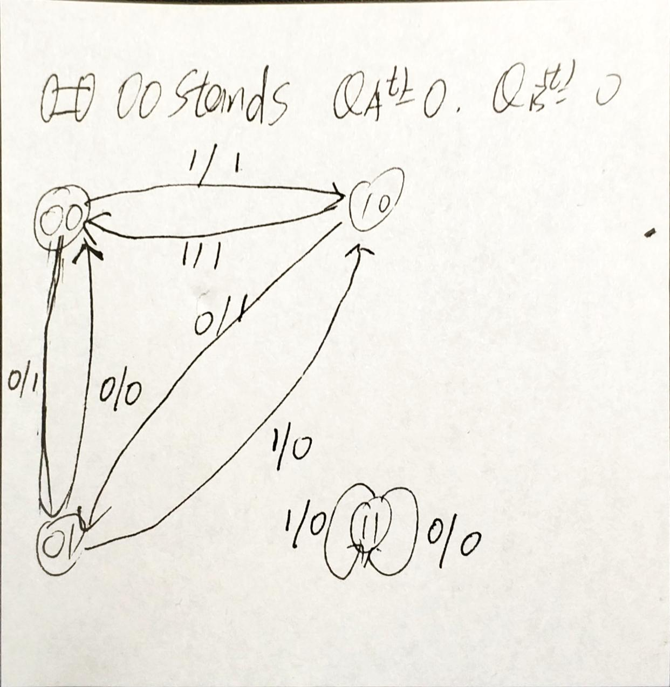
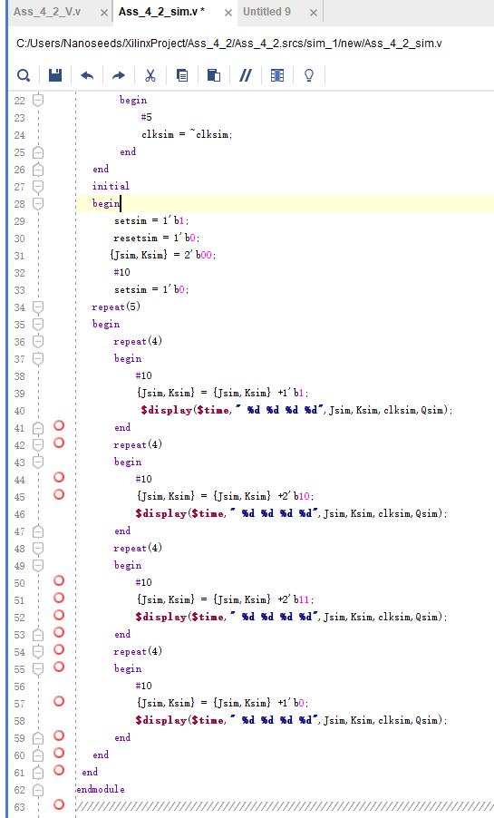
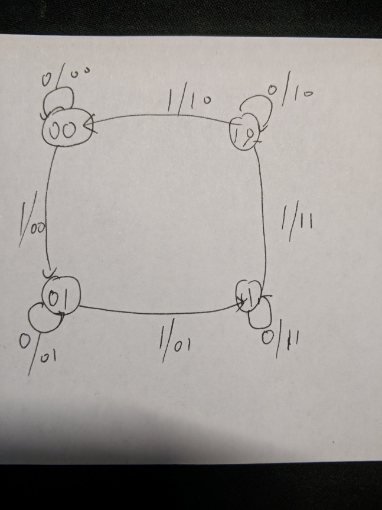

<!--
 * @Github: https://github.com/Certseeds/CS207_Digital_Design
 * @Organization: SUSTech
 * @Author: nanoseeds
 * @Date: 2020-08-12 23:56:44
 * @LastEditors: nanoseeds
 * @LastEditTime: 2020-08-13 00:03:08
-->
# DIGITAL DESIGN ASSIGNMENT REPORT


<div style="text-align:center">
ASSIGNMENT ID : ${Lab_Number} </br>
Student Name: ${YOUR_NAME}  </br>
Student ID: ${YOUR_ID} </br>  
</div>

## PART 1: DIGITAL DESIGN THEORY 
1. The Feature table of the T flip-flop is as the form

|       |       |        |
| :---: | :---: | :----: |
|   T   | Q(t)  | Q(t+1) |
|       | Q(t)  |  Q(t)  |
|   1   | Q(t)  | Q'(t)  |

We can get the complement output of a T flip-flop is just make complement of a T flip-flop, Q(t+1) is the next Q and the output at the same time. So do Q'(t+1) for implement T flip-flop.

|       |       |        |
| :---: | :---: | :----: |
|   T   | Q(t)  | Q(t+1) |
|   0   | Q(t)  | Q'(t)  |
|   1   | Q(t)  |  Q(t)  |

So, if we view the T and Q(t) are variables, then table of complement output of T flip-flop is.

|       |       |         |
| :---: | :---: | :-----: |
|   T   | Q(t)  | Q'(t+1) |
|   0   |   0   |    1    |
|   0   |   1   |    0    |
|   1   |   0   |    0    |
|   1   |   1   |    1    |

Then we find the minimum sums in 

|       |     0     |      1      |
| :---: | :-------: | :---------: |
|   0   | TQ(t) (√) |   TQ'(t)    |
|   1   |  T'Q(t)   | T'Q'(t) (√) |

We can find Q'(t+1) is the m0 + m3 which is TQ(t) and T'Q'(t)(in there whether 0 or 1 stand T is ok).
So Q'(t + 1) = T'Q'(t)+ TQ(t)

2.|Because the T flip-flop don't have reset function.
So we should suppose all the states of the A(t) and B(t).

| A(t) | B(t)  | TA = (A(t) or B(t)) | TB = (A'(t) or B(t)) | A(t+1) | B(t+1) | Output: B'(t) |
| :--- | :---: | :-----------------: | :------------------: | :----: | :----: | ------------: |
| 0    |   0   |          0          |          1           |   0    |   1    |             0 |
| 0    |   1   |          1          |          1           |   1    |   0    |             1 |
| 1    |   0   |          1          |          0           |   0    |   0    |             1 |
| 1    |   1   |          1          |          1           |   0    |   0    |             1 |

It is easy to analysis that TA: the reverse signal of A(t) is A(t) or B(t) and TB is A'(t) or  B(t)  
In this state table, the input is the function of A and B's output .because the T flip-flop have one input and this input is filled by the output of A and B.
In this circuit exist a possible output B'(t).
The state diagram is


In this circuit the whether the start state is what, it will fall in the circulate in few steps.
The circulate is 
A(t) = 0,B(t) = 0→A(t) = 0,B(t)= 1→ A(t) = 1,B(t) = 0 → A(t) = 0,B(t) = 0
And the output is 1→0→1→1→0→1→1→0→1 such a circulate.
The circulate will jump in those steps in every posedge of input clk.

3. 
The equation of JK flip-flop is Q(t+1) = JQ'(t) + K'Q(t)
So QA(t+1) = JAQA'(t) + KA'QA(t) = x QA'(t) + QB(t)QA(t).
QB(t+1) = JBQB'(t) + KB'QB(t) = x' QB'(t) + QA(t)QB(t).

|  QA   |  QB   |   x   | QA+1  | QB+1  |
| :---: | :---: | :---: | :---: | :---: |
|   0   |   0   |   0   |   0   |   1   |
|       |       |   1   |   1   |   0   |
|   0   |   1   |   0   |   0   |   0   |
|       |       |   1   |   1   |   0   |
|   1   |   0   |   0   |   0   |   1   |
|       |       |   1   |   0   |   0   |
|   1   |   1   |   0   |   1   |   1   |
|       |       |   1   |   1   |   1   |

Because the question don't give any information about output, so in this diagram output is B'(t) the only possibly output.


## PART 2: DIGITAL DESIGN LAB

### TASK1
The words before codes and graph
1. In task1 we should build a D flip-flop first 
2. use the D flip-flop to build T flip-flop.
3. Write testbench to test it.

#### DESIGN 
Words before codes:
in this part if D and T flip-flop don't add any reset, the T can not do it function at all because t he begins state of T's output is unstable. 
The D flip-flop code:

``` verilog
`timescale 1ns / 1ps
module Ass_4_1_D(
input clk,
input D,
input reset,
output wire Q,
output wire Qtran
    );
    reg Qtemp;
    always @(posedge clk,posedge reset,negedge reset)
    begin
        if (reset)
            begin
            Qtemp = 0;
            end
        else 
            begin
            Qtemp = D;
            end  
    end
    assign Q = Qtemp;
    assign Qtran = ~Q;
endmodule

```


The T flip-flop code:

``` verilog
`timescale 1ns / 1ps
module Ass_4_1_T(
input clk,
input T,
input reset,
output wire Q,
output wire Qtran
    );
   Ass_4_1_D test1(
     .clk(clk),
     .reset(reset),
     .D((~T & Q) | (T & ~Q)),
     .Q(Q),
     .Qtran(Qtran));
Endmodule
```


#### SIMULATION
During the simulation, reset should be set first and then be 0;
Code:

``` verilog
`timescale 1ns / 1ps
module Ass_4_1_sim(

    );
reg   Tsim,clksim;
reg resetsim;
wire Qsim;
wire Qtransim;
Ass_4_1_T test2(
.T(Tsim),
.clk(clksim),
.reset(resetsim),
.Q(Qsim),
.Qtran(Qtransim)
);

initial 
    begin
    clksim = 1'b0;
    resetsim = 1'b1;
    #5
    resetsim = 1'b0;
    repeat(200)
        begin
        #5 
        clksim = ~clksim;
        $display($time," %d %d %d %d",Qsim,Qtransim,Tsim,clksim); 
        end
    end
initial 
    begin
    Tsim = 1'b0; 
   repeat(100)
       begin
         #10
         Tsim = ~Tsim;
       end
    end
endmodule
```


all of the code and waves is correct, after my calculate all of them are right.

Decibel of wave: 

``` poem
oh! 
What a beautiful wave you are! 
You repeat dozens of times
Every time obey the same law.
solemn and respectful, dignified and stately
a wonderful product of vivado!
The waves are correct after verification.
```


The graphs upper of this sentence is values in system task
FINALLY all of the code and waves is correct, after my calculate all of them are right.


#### PROBLEMS AND SOLUTIONS
1. If we don't give D and T flip-flop a reset input, we cannot make it have output. Because in the first no output is defined but T flip-flop need output to be input.
+ Solutions: add two reset input in D and T flip-flop.

2. Sometimes it will happen some strange things
+ Solutions: close vivado and open it again or even reboot computer


#### ADDITION
Describe of waves and codes in Simulation is provide
Problems and solution are provided
Description of waves are provided


### Task2
The words before codes and graph
1. Using UDP do not like others, make sure the order of input and output. 
2. When using udp way to design it, there can not appear other variables to stand the input values.
3. the UDP file cannot be used in synthesized, just the data flow way can be used in the last steps.
4. Use a reg variable to make it.

#### DESIGN 
Code:

``` verilog
`timescale 1ns / 1ps
primitive Ass_4_2_V(
Q,
J,
K,
clk,
set,
reset
    );
    output Q;
    input J;
    input K;
    input clk;
    input set;
    input reset;
    reg Q;
    initial Q = 0;
    table
    ? ? (?0) ? ? : ? : -;
    (??) ? ? ? ? : ? : -;
    ? (??) ? ? ? : ? : -; 
 // J K  clk set reset
    ? ? (01) 1 0 : ? : 1;
    1 0 (01) ? ? : ? : 1;   
    // set zhiwei
    ? ? (01) 0 1 : ? : 0;
    0 1 (01) ? ? : ? : 0;   
    // reset fuwei
    0 0 (01) 0 0 : ? : -;
    // J 0 K 0,no set and reset Q(t+1) = Q(t)
    1 1 (01) 0 0 : 1 : 0;
    1 1 (01) 0 0 : 0 : 1;
   // J 1 K 1, no set and reset  Q(t+1) = ~Q(t)
    endtable
endprimitive
```


#### SIMULATION
Code:

``` verilog
`timescale 1ns / 1ps
module Ass_4_2_sim(
    );
    reg Jsim;
    reg Ksim;
    reg clksim;
    reg setsim;
    reg resetsim;
    wire Qsim;
    Ass_4_2_V test1(
    .J(Jsim),
    .K(Ksim),
    .clk(clksim),
    .set(setsim),
    .reset(resetsim),
    .Q(Qsim)
    );
    initial 
    begin
        clksim = 1'b0;
        repeat(200)
        begin
            #5
            clksim = ~clksim;
        end
   end
   initial 
   begin
       setsim = 1'b1;
       resetsim = 1'b0;
      {Jsim,Ksim} = 2'b00;
       #10
       setsim = 1'b0;
   repeat(5)
   begin
       repeat(4)
       begin
           #10
           {Jsim,Ksim} = {Jsim,Ksim} +1'b1;
            $display($time," %d %d %d %d",Jsim,Ksim,clksim,Qsim); 
       end   
       repeat(4)
       begin
           #10
           {Jsim,Ksim} = {Jsim,Ksim} +2'b10;
           $display($time," %d %d %d %d",Jsim,Ksim,clksim,Qsim); 
       end      
       repeat(4)
       begin
           #10
           {Jsim,Ksim} = {Jsim,Ksim} +2'b11;
           $display($time," %d %d %d %d",Jsim,Ksim,clksim,Qsim); 
       end
       repeat(4)
       begin
           #10
           {Jsim,Ksim} = {Jsim,Ksim} +1'b0;
           $display($time," %d %d %d %d",Jsim,Ksim,clksim,Qsim); 
       end
   end
 end
endmodule
```





The waves is correct, after my calculate all of them are right


FINALLY, all of the code and waves is correct, after me calculate all of them are right.
The waves are correct after verification.

#### THE DESCRIPTION OF OPERATION
1. build a udp file using the input and output state
2. write the testbench to test it
3. take photos and write the word in paper.

#### PROBLEMS AND SOLUTIONS
1. Sometimes it will happen some strange things
+ Solutions: close vivado and open it again or even reboot computer

2. When creat a sim files in the folder, the udp file will go to non-files folder
+ Solutions: just add the _v file into the sim file then the simulation will be ok to run

3. The simulation has so much red (means unknown state)
+ Solutions: add state to ignore negative edge of clk and changes on steady clk

#### ADDITION
Describe of waves and codes in Simulation is provide
Problems and solution are provided
Description of waves are provided


### Task3
The words before codes and graph
1. Write the state table 
2. Try to find the state equation
3. Make it in structured style using the D-flip-flop used in Ass_4_1
4. Write a behavior modeling 
5. Write the testbench and write the work

The state tables

| reset | x_in  | state (state now) | state(t+1) (output and next state) |
| :---: | :---: | :---------------: | :--------------------------------: |
|   1   |   ?   |         ?         |                 00                 |
|   0   |   0   |         ?         |          (do not change)           |
|   0   |   1   |        00         |                 01                 |
|   0   |   1   |        01         |                 11                 |
|   0   |   1   |        11         |                 10                 |
|   0   |   1   |        10         |                 00                 |

And the graph



We can get the equation that 
Q[0](t+1) = {(x_in) & (~Q[1](t))} | {(~x_in) &(Q[0](t))}  
Q[1](t+1) = {(x_in) &(Q[0](t)) } | {(~x_in) &(Q[1](t))}  
After simply it is  
Q[0] = {x_in & ~Q[1]} | {~x_in)&Q[0]}  
Q[1] = {x_in & Q[0] } | {~x_in &Q[1]}  
So the first x_in input of D-flip-flop should be {x_in & ~Q[1]} | {~x_in)&Q[0]} and output is Q[0]  
The second one's x_in should be {x_in & Q[0] } | {~x_in &Q[1]} and output is Q[1]
In structured design  


#### DESIGN 
1. structured style Code:

I the D-flip-flop-code

```verilog
`timescale 1ns / 1ps
module  Ass_4_3_D(
input clk,
input D,
input reset,
output wire Q,
output wire Qtran
    );
    reg Qtemp;
    always @(posedge clk,posedge reset,negedge reset)
    begin
        if (reset)
            begin
            Qtemp = 0;
            end
        else 
            begin
            Qtemp = D;
            end  
    end
    assign Q = Qtemp;
    assign Qtran = ~Q;
endmodule
``` 


II. the main design code:

``` verilog
`timescale 1ns / 1ps
module Ass_4_3_ff(
input x_in,
input clk,
input reset,
output [1:0]state
    );
    wire useless;
Ass_4_3_D test1(
.D((x_in & ~state[1]) | (~x_in & state[0])),
.clk(clk),
.reset(reset),
.Q(state[0]),
.Qtran(useless)
);
Ass_4_3_D test2(
.D((x_in & state[0]) | (~x_in & state[1])),
.clk(clk),
.reset(reset),
.Q(state[1]),
.Qtran(useless)
);
endmodule
```


2. the behavior-design-code

``` verilog
`timescale 1ns / 1ps
module Ass_4_3_v(
input clk,
input reset,
input x_in,
output[1:0] state
    );
    reg [1:0] state,next_state;
    parameter S0 = 2'b00,S1 = 2'b01,S2 = 2'b10,S3 = 2'b11;
always @(posedge clk,posedge reset)
begin
    if (reset)
    begin
        state <= S0;
    end
    else
    begin 
        state <= next_state;
    end    
end

always @(state,x_in)
  begin
     if (x_in)
     begin
         case(state)
         S0 :next_state <= S1;
         S1 :next_state <= S3;
         S3 :next_state <= S2;
         S2 :next_state <= S0;
         endcase
     end
     else 
     begin
         next_state <= state;
     end    
 end    
  
endmodule
```


#### SIMULATION
Because both of the file use the same input name so the simulation use an line of // code to switch the simulation. 
Code:

``` verilog
`timescale 1ns / 1ps
module Ass_4_3_sim(
    );
reg clksim;
reg resetsim;
reg x_in_sim;
wire [1:0]statesim;
Ass_4_3_v test1(
//Ass_4_3_ff test1(
.clk(clksim),
.reset(resetsim),
.x_in(x_in_sim),
.state(statesim));
initial
begin
    clksim = 1'b0;
    repeat(200)
    begin
        #5
        clksim = ~clksim;
    end
end
initial 
begin
    resetsim = 1'b1;
    x_in_sim = 1'b0;
    #10
    resetsim = 1'b0;
    repeat(100)
    begin
        #10
        x_in_sim = ~x_in_sim;
    end
end
endmodule
```


It is obvious that the two graph is the same although they are come from two different .v file because the function of them are same.
The waves is correct, after my calculate all of them are right
FINALLY all of the code and waves is correct, after my calculate all of them are right
the input and output is easy enough to understand so it don’t need display in the TCL console.

``` poem
oh! 
What a beautiful wave you are! 
You repeat dozens of times
Every time obey the same law.
solemn and respectful, dignified and stately
a wonderful product of vivado!
```

#### THE DESCRIPTION OF OPERATION
1. Make it in structured style using the D-flip-flop used in Ass_4_1.
2. Write a behavior modeling 
3. Write the testbench and write the work

#### PROBLEMS AND SOLUTIONS
1. Sometimes it will happen some strange things
+ Solutions: close vivado and open it again or even reboot computer

2. The Qtran is useless
+ Solutions: use a wire variable “useless” to get connect with it.

3. Maybe someone will don’t know one or two stages 
+ Solutions: whether stage is ok if it is written without mistake

#### ADDITION
Describe of waves and codes in Simulation is provide
Problems and solution are provided
