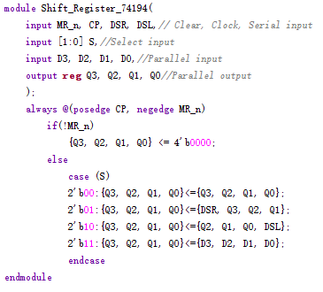
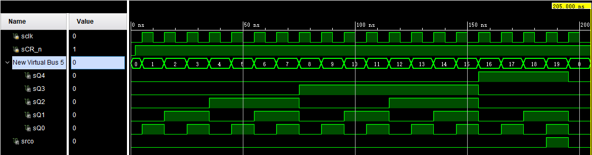

<!--
 * @Github: https://github.com/Certseeds/CS207_Digital_Design
 * @Organization: SUSTech
 * @Author: nanoseeds
 * @Date: 2020-08-12 23:56:44
 * @LastEditors: nanoseeds
 * @LastEditTime: 2020-08-13 00:03:08
-->
# DIGITAL DESIGN ASSIGNMENT REPORT


<div style="text-align:center">
ASSIGNMENT ID : ${Lab_Number} </br>
Student Name: ${YOUR_NAME}  </br>
Student ID: ${YOUR_ID} </br>  
</div>

## PART 1: DIGITAL DESIGN THEORY 
1. First stage of register:


2. Following are two possible solution for the problem.
Solution 1:


3. 
+ (a) The 8 valid states are 0, 8, 12, 14, 15, 7, 3, 1.
The 8 unused states and their next states are shown below:


+ (b) Modification: DC = (A + C)B.


The valid states are the same as in (a). The unused states have the following sequences:	2➡️ 9➡️ 4➡️ 8 and 10➡️ 13➡️ 6➡️11➡️ 5➡️ 0. The final states, 0 and 8, are valid.


## PART 2: DIGITAL DESIGN LAB

### TASK1

#### DESIGN 
1. Code 1

``` verilog
module Task1(
  input clk,
  input rst_n,
  input serial_in,
  output o,
  output Q4,Q3,Q2,Q1,Q0
);
Shift_Register_74194 u(
  rst_n,
  clk,
  serial_in,
  0,2'b01,0,0,0,0,
  Q4,Q3,Q2,Q1
);
D_FF d(clk,rst_n,Q1,Q0);
wire Q2n,Q3n;
not nu1(Q2n,Q2);
not nu1(Q3n,Q3);
and_5 au(Q0,Q1,Q2n,Q3n,Q4,o);
endmodule
```


2. And gate with five input

``` verilog
module and_5(input in1,in2,in3,in4,in5,output 0);
and au(o,in1,in2,in3,in4,in5);
endmodule
```


3. 74174 chip

``` verilog
module Shift_Register_74194(
    inupt MR_n,CP,DSR,DSL, // clear, clock serial_input
    input [1:0] S, // select input
    input D3,D2,D1,D0,// Paraller input
    output reg Q3,Q2,Q1,Q0 // paraller output
);

always @(posedge CP,negege MR_n)
    if(!MR_n)
        {Q3,Q2,Q1,Q0} <= 4'b0000
    else
        case (S)
            2'b00: {Q3,Q2,Q1,Q0} <= {Q3,Q2,Q1,Q0};
            2'b01: {Q3,Q2,Q1,Q0} <= {DSR,Q3,Q2,Q1};
            2'b10: {Q3,Q2,Q1,Q0} <= {Q2,Q1,Q0,DSL};
            2'b11: {Q3,Q2,Q1,Q0} <= {D3,D2,D1,D0};
        endcase

endmodule
```



4. D filp-flop

``` verilog
module D_FF(input clk,rst_n,D,output reg Q);
    always@(posedge clk,negedge rst_n)
    begin
        if(~rst_n)
            Q <= 1'b0;
        else
            Q <= D;
    end
endmodule
```


Schematic


#### SIMULATION
Code:

``` verilog
module task1tb();
    reg sclk, srst_n,sserial_in;
    wire so,sQ4,sQ3,sQ2,sQ1,sQ0;
    initial begin
        sclk = 0;
        sserial_in = 0;
        #1 srst_n = 0;
        #10 sserial_in = 1;
        #10 sserial_in = 1;  
        #10 sserial_in = 0;
        #10 sserial_in = 0;
        #10 sserial_in = 1;
        #10 sserial_in = 0;
        #10 sserial_in = 0;
        #10 sserial_in = 1;
        #10 sserial_in = 0;
        #10 sserial_in = 1;
        #10 $finish;
    end
    always #5 sclk = ~sclk;
    Task1 u(sclk,srst_n,sserial_in,so,sQ4,sQ3,sQ2,sQ1,sQ0);
endmodule
```


waveform


#### CONSTRAINT FILE AND THE TESTING
None

#### THE DESCRIPTION OF OPERATION
Null

### Task2

#### DESIGN 
1. JKFF

``` verilog
module JKFF(input clk,rst_n,J,K,output reg Q,output Qn);
    assign Qn = ~Q;
    always@(posedge clk,negedge rst_n)
    begin
        if(~rst_n)
            Q <= 1'b0;
        else
            case({J,K})
                2'b00: Q <= Q;
                2'b01: Q <= 1'b0;
                2'b10: Q <= 1'b1;
                2'b11: Q <= Qn;
            endcase;
    end
endmodule
```


2. Task2 warpper

``` verilog
module Task2(input clk,rst_n,output Q3,Q2,Q1,Q0);
    JKFF u0(clk, rst_n, 1, 1, Q0);
    JKFF u0(Q0, rst_n, 1, 1, Q1);
    JKFF u0(Q1, rst_n, 1, 1, Q2);
    JKFF u0(Q2, rst_n, 1, 1, Q3);
endmodule
```


#### SIMULATION

``` verilog
module task2tb();
    reg sclk, srst_n;
    wire sQ3, sQ2, sQ1, sQ0;
    initial begin
        sclk = 0;
        srst_n = 0;
        #2 srst_n = 1;
    end
    initial #200 $finish;
    alwats #5 sclk = ~sclk;
    Task2 u(sclk, srst_n, sQ3, sQ2, sQ1, sQ0);
endmodule
```


#### CONSTRAINT FILE AND THE TESTING
nullptr

#### THE DESCRIPTION OF OPERATION
undefined


### Task3

#### DESIGN 
1. modulo20_74161_L

``` verilog
module modulo20_74161_L(
    input clk,
    input CR_n,
    output Q4, Q3, Q2, Q1, rco
    );
    wire Q7,Q6,Q5;
    wire irco;
    assign rco = Q4 & Q1 & Q0;
    Counter74161 u1(clk, 1, 1, CR_n, ~(Q4 & Q1 & Q0), 0, 0, 0, 0, Q4, Q3, Q2, Q1,irco);
    Counter74161 u1(clk, icro, icro, CR_n, ~(Q4 & Q1 & Q0),0, 0, 0, 0, Q7, Q6, Q5, Q4);
endmodule
```


schematic


2. modulo20_74161_C

``` verilog
module modulo20_74161_C(
    input clk,
    input CR_n,
    output Q4, Q3, Q2, Q1, rco
    );
    wire Q7,Q6,Q5;
    wire irco;
    assign rco = Q4 & Q1 & Q0;
    Counter74161 u1(clk, 1, 1, CR_n & ~(Q4 & Q2), 1, 0, 0, 0, 0, Q3, Q2, Q1, Q0,irco);
    Counter74161 u1(clk, icro, icro, CR_n & ~(Q4 & Q2), 1,0, 0, 0, 0, Q7, Q6, Q5, Q4);
endmodule
```


schematic


3. modulo20Counter
  
``` verilog
module modulo20Counter(
    input clk,
    input updown,
    input ld_n,
    input cr_n,
    input D4, D3, D2, D1, D0,
    output reg Q4, Q3, Q2, Q1, Q0,
    output rco
    );
    assign rco = Q4 & Q1 & Q0;
    always @(posedge clk)
    begin
        if(~cr_n)
            {Q4, Q3, Q2, Q1, Q0} <= 5'b00000;
        else if(~ld_n)
            {Q4, Q3, Q2, Q1, Q0} <= {D4, D3, D2, D1, D0};
        else if(updown)
            if ({Q4, Q3, Q2, Q1, Q0} == 5'b10011)
                {Q4, Q3, Q2, Q1, Q0} == 5'b00000;
            else
                {Q4, Q3, Q2, Q1, Q0} == {D4, D3, D2, D1, D0} + 1;
        else 
            if ({Q4, Q3, Q2, Q1, Q0} == 5'b00000)
                {Q4, Q3, Q2, Q1, Q0} == 5'b10011;
            else
                {Q4, Q3, Q2, Q1, Q0} == {D4, D3, D2, D1, D0} - 1;
    end
endmodule
```


#### SIMULATION
1. L's simulation

``` verilog
module modulo20_74161_L_tb();
    reg sclk,sCR_n;
    wire sQ4, sQ3, sQ2, sQ1, sQ0, srco;
    initial begin
        sclk= 0;
        sCR_n = 0;
        #2 sCR_n = 1;
    end
    initial #205 $finish;
    always #5 sclk = ~sclk;
    modulo20_74161_L u(sclk,sCR_n, sQ4, sQ3, sQ2, sQ1, sQ0, srco);
endmodule
```


wavefrom


2. C's simulation

``` verilog
module modulo20_74161_L_tb();
    reg sclk,sCR_n;
    wire sQ4, sQ3, sQ2, sQ1, sQ0, srco;
    initial begin
        sclk= 0;
        sCR_n = 0;
        #2 sCR_n = 1;
    end
    initial #205 $finish;
    always #5 sclk = ~sclk;
    modulo20_74161_C u(sclk,sCR_n, sQ4, sQ3, sQ2, sQ1, sQ0, srco);
endmodule
```


wavefrom



3. modulo20Counter_tb

``` verilog
module modulo20Counter_tb();
    reg sclk, supdown, sld_n, scr_n, sD4, sD3, sD2, sD1, sD0;
    wire sQ4, sQ3, sQ2, sQ1, sQ0, srco;
    initial begin
        sclk = 0;
        scr_n = 0;
        sld_n = 1;
        supdown = 1;
        {sD4, sD3, sD2, sD1, sD0} = 5'b10010;
        #6 src_n = 1;
        #15 sld_n = 0;
        #20 sld_n = 1;
        #250 supdown = 0;
    end
    initial #500 $finish;
    always #5 sclk = ~sclk;
    modulo20Counter u(sclk, supdown, sld_n, scr_n, sD4, sD3, sD2, sD1, sD0, sQ4, sQ3, sQ2, sQ1, sQ0, srco);
endmodule
```


wave


#### CONSTRAINT FILE AND THE TESTING
unknown

#### THE DESCRIPTION OF OPERATION
nil